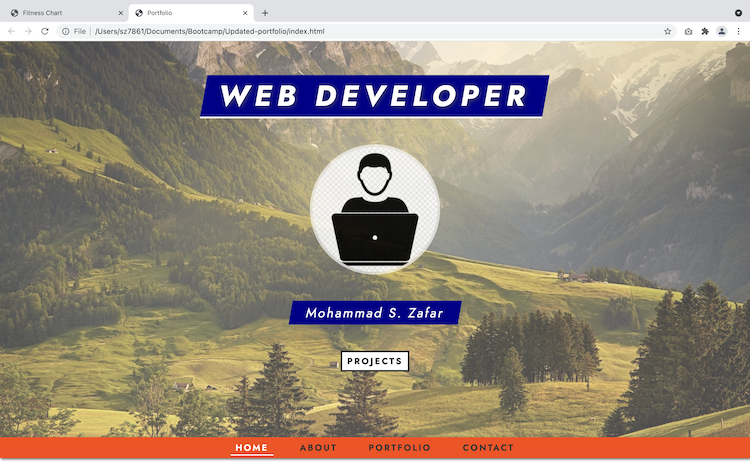
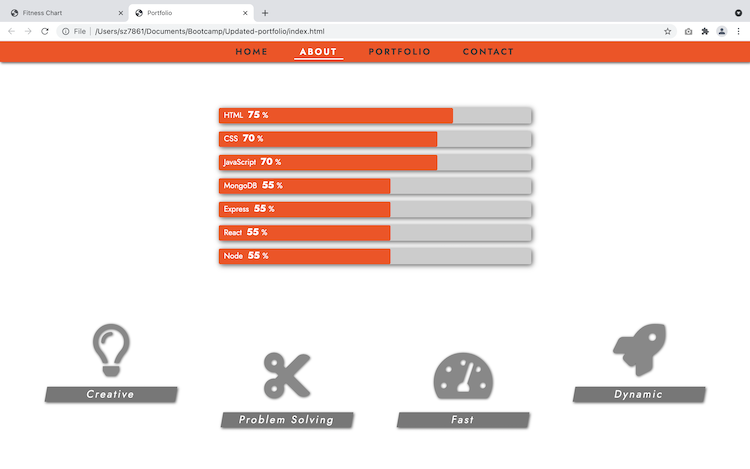
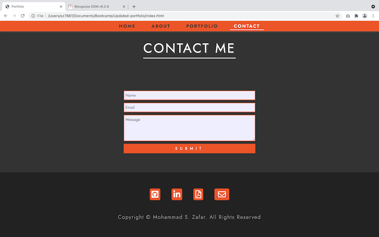

# Updated-portfolio

A responsive portfolio, showcasing some of my projects and skills gained after 4 months of coding.

It was great to watch several styling tutorials and build a frontend project (having focused mainly on backend for the last 8 weeks).

I have experimented with hover effects, font-awesome icons and contrasting colour schemes.

# Screenshots

  
  
  

